# Introduction
- [Introduction](#introduction)
  - [Installation](#installation)
  - [Running the app](#running-the-app)
  - [リファクタリングのポイント](#リファクタリングのポイント)
    - [アプリ構造を見直す](#アプリ構造を見直す)
    - [ネーミングを明確にする](#ネーミングを明確にする)
    - [コメント文は必要最低限](#コメント文は必要最低限)
    - [ネストをできるだけ浅くする](#ネストをできるだけ浅くする)


## Installation

```bash
pip install -r requirements.txt
```

## Running the app

```bash
python -m main
```

## リファクタリングのポイント

### アプリ構造を見直す

main.pyを起動スクリプトにして、以下の順番で処理を実行する。

1. No.1～1008のポケモン諸元値を取得する。
   1. HTTPリクエスト
   2. ポケモン諸元値オブジェクト生成
   3. コレクションに追加 
2. JSON形式で出力する。

<details>
<summary>構成図</summary>


</details>


### ネーミングを明確にする

情報量ゼロの変数名、メソッド名を使用しない。
スコープが超狭い、indexの役割しかないといった場合は許容する。

```python
# bad
a, b, temp, *info, *list, *dict

# better
pokemon_spec, to_json
```

パスとファイル名で、役割を察することがある程度可能。

|  ファイル名  |  役割  |
| ---- | ---- |
|  main.py  |  起動スクリプト、メインロジック |
|  pokemon_specifications.py  |  ポケモン諸元値一覧に関する処理  |
|  model/pokemon_spec.py  |  ポケモン諸元値に関する処理  |
|  model/vo/*.py  |  各種諸元値に関する処理  |
|  repository/pokemon_spec.py  |  ポケモン諸元値の参照処理(IF)  |
|  infrastructure/pokemon_spec.py  |  ポケモン諸元値の参照処理(実体)  |

### コメント文は必要最低限

python docstring形式でファイル、クラス、メソッドの説明を書く。
見ればわかる程度の処理の詳細など、無意味なコメントは書かない。
⇒ コメントを大量に書かないといけないような処理は、メソッドやクラスを切ることを検討する。
型ヒントも使用すれば可読性も上がる。

### ネストをできるだけ浅くする

   * 早期リターン
   * if文、swtich文撲滅

